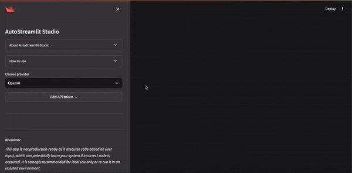

<div align="center">

# AutoStreamlit Studio

[![GitHub][github_badge]][github_link]
[![Licence][licence_badge]][licence_link] 
[](#supported-python-versions)
[](https://github.com/psf/black) 

</div>

## Introduction

Welcome to `AutoStreamlit Studio`, your intelligent assistant designed to effortlessly create **Streamlit applications**. With `AutoStreamlit Studio`, simply provide your requirements through a prompt, and the tool takes care of the rest. It automatically generates, customizes, and runs a Streamlit app tailored to your specifications. Whether you need data visualization, interactive dashboards, or any other Streamlit functionality, `AutoStreamlit Studio` simplifies the process, turning your ideas into functional apps in no time. This innovative tool is designed to save time and enhance productivity for both developers and non-developers alike.

## Features

- **Automatic App Generation**: Provide your requirements, and AutoStreamlit Studio generates a complete Streamlit app for you.
- **Customizable Templates**: Choose from a variety of templates to kickstart your app development.
- **Interactive Widgets**: Add interactive elements like charts, tables, and forms effortlessly.
- **Voice Commands**: Use voice commands to interact with the tool and generate apps (OpenAI provider only).
- **Code Editor**: Edit the generated code directly within the app for further customization.
- **Version Control**: Manage different versions of your app to track changes and improvements.
- **File Operations**: Easily download, upload, and run Streamlit app files.
- **API Token Management**: Securely manage your API tokens for **OpenAI** and **Replicate** providers.
- **Error Handling and Resolution**: Automatically handle code errors and provide solutions.
- **Session Management**: Automatically handles session expiration and maintains chat history and code state.

<div align="center">



</div>

> [!IMPORTANT]
> This app is not **production-ready** as it executes code based on user input, which can potentially harm your system if incorrect code is executed. It is strongly recommended for **local** use only or to run it in an **isolated environment**.

## How to Use
1. **Select Provider and Enter API Key**: Choose your provider (**OpenAI** or **Replicate**) and enter the API key to unlock the app's functionality.
2. **Enter Your Requirements**: Use the chat input box to specify your app requirements.
3. **Generate the Script**: AutoStreamlit Studio will generate a Streamlit script based on your input.
4. **View Past Conversations**: Check the chat history in the expander.
5. **Use Predefined Templates**: Choose from predefined templates to quickly create apps.
6. **Edit and Run**: Edit the generated script through chat or directly in developer mode, then run the script.
7. **Save, Load, or Reset Versions**: Use the version control to manage different versions of your app.
8. **Clear Chat History**: Use the 'Clear chat history' button to delete previous chats.
9. **Delete App File**: Use the 'Delete app file' button to remove the current app.
10. **Download the Script**: Download the generated script as a `.py` file.
11. **Handle Errors**: The app identifies errors in the generated code and provides options to resolve them.

## Running the App Locally

### Prerequisites
- Python `3.9` or later
- Virtual Environment (recommended)

### Installation Steps
1. **Clone the Repository**:
    ```sh
    git clone <repository-url>
    cd auto-streamlit
    ```

2. **Create and Activate a Virtual Environment**:
    ```sh
    python -m venv .venv
    source .venv/bin/activate  # On Windows use `.venv\Scripts\activate`
    ```

3. **Install the Dependencies**:
    ```sh
    pip install --upgrade pip
    pip install -r requirements.txt
    ```

4. **Run the Streamlit App**:
    ```sh
    streamlit run app.py
    ```

5. **Access the App**:
    Open your web browser and navigate to `http://localhost:8501`.

## Running the App with Docker

### Prerequisites
- Docker

### Build and Run Steps
1. **Clone the Repository**:
    ```sh
    git clone <repository-url>
    cd auto-streamlit
    ```

2. **Build the Docker Image**:
    ```sh
    docker build -t autostreamlit-studio .
    ```

3. **Run the Docker Container**:
    ```sh
    docker run -p 8501:8501 autostreamlit-studio
    ```

4. **Access the App**:
    Open your web browser and navigate to `http://localhost:8501`.

## Sidebar UI
The sidebar of AutoStreamlit Studio provides various functionalities to manage your app development process:
- **About AutoStreamlit Studio**: Learn more about the tool and its capabilities.
- **How to Use**: Detailed instructions on how to interact with the tool.
- **API Token Management**: Securely manage your API tokens for OpenAI and Replicate providers.
- **Chat History**: View the history of your interactions with the assistant.
- **Template Selection**: Choose from a variety of pre-defined templates to start your app.
- **Version Control**: Manage different versions of your app to keep track of changes.
- **Code Editor**: Edit the generated code directly within the app.


## Getting Started
To get started with AutoStreamlit Studio, follow these steps:
1. **Set Up the Environment**: Ensure you have the necessary API tokens for OpenAI or Replicate.
2. **Run the App**: Execute the main script to start the AutoStreamlit Studio.
3. **Interact with the Assistant**: Use the chat input to specify your app requirements and watch as your app is generated in real-time.
4. **Customize and Extend**: Use the built-in code editor to make any custom changes to your app.

## Predefined Packages for Streamlit Apps

`AutoStreamlit Studio` comes with a set of predefined packages that are commonly used for creating powerful and interactive Streamlit applications. These packages are essential for data manipulation, visualization, machine learning, and more. Here are some of the key packages included:

- **numpy**: A fundamental package for numerical computing in Python, providing support for arrays, mathematical functions, and more.
- **pandas**: A powerful data manipulation library for data analysis and manipulation of structured data.
- **matplotlib**: A plotting library for creating static, animated, and interactive visualizations in Python.
- **seaborn**: A statistical data visualization library based on matplotlib, providing a high-level interface for drawing attractive and informative statistical graphics.
- **scikit-learn**: A machine learning library for Python, offering simple and efficient tools for data mining and data analysis.
- **plotly**: An interactive graphing library that makes it easy to create complex plots with high interactivity.
- **tensorflow**: An open-source library for machine learning and deep learning applications.
- **streamlit**: The core library that allows you to create interactive and beautiful web apps directly from Python scripts.
- **altair**: A declarative statistical visualization library based on Vega and Vega-Lite, providing a simple and intuitive syntax.
- **beautifulsoup4**: A library for parsing HTML and XML documents, useful for web scraping.
- **requests**: A simple and elegant HTTP library for making API requests.
- **scipy**: A library for scientific and technical computing, complementing numpy.
- **SQLAlchemy**: A SQL toolkit and Object-Relational Mapping (ORM) library for Python.
- **folium**: A library for creating interactive maps.

These selected packages are pre-installed among others to ensure that you have all the necessary tools to build a wide range of Streamlit applications, from data analysis and visualization to machine learning and web scraping.

For a complete list of dependencies, please refer to the `requirements.txt` file included in the repository.

By leveraging these powerful libraries, AutoStreamlit Studio enables you to quickly and efficiently develop Streamlit applications tailored to your specific needs.

## How to Open Issues

Submit Issues: Encounter a bug or have a feature idea? Let us know through our  [issues page](https://github.com/stavrostheocharis/auto-streamlit/issues).


## How to Contribute

Contributions are welcome! If you'd like to contribute to `AutoStreamlit Studio`, please follow these steps:

1. **Fork the Repository**: Click on the 'Fork' button at the top right of the repository page to create a copy of the repository on your GitHub account.
2. **Clone the Repository**: Clone your forked repository to your local machine.
    ```sh
    git clone <your-forked-repo-url>
    cd auto-streamlit
    ```
3. **Create a Branch**: Create a new branch for your feature or bug fix.
    ```sh
    git checkout -b feature-or-bugfix-name
    ```
4. **Make Changes**: Make your changes to the codebase.
5. **Commit Changes**: Commit your changes with a descriptive commit message.
    ```sh
    git add .
    git commit -m "Description of the feature or bug fix"
    ```
6. **Push Changes**: Push your changes to your forked repository.
    ```sh
    git push origin feature-or-bugfix-name
    ```
7. **Create a Pull Request**: Go to the original repository on GitHub and create a pull request from your forked repository. Provide a clear description of the changes and any related issue numbers.

Thank you for contributing!


## Conclusion
AutoStreamlit Studio is designed to revolutionize the way you create Streamlit applications. With its intelligent assistant, customizable templates, and interactive features, you can quickly turn your ideas into functional apps, saving time and boosting productivity. Whether you are a developer looking to streamline your workflow or a non-developer needing to create powerful data-driven apps, AutoStreamlit Studio is your go-to solution.


[github_badge]: https://badgen.net/badge/icon/GitHub?icon=github&color=black&label

[github_link]: https://github.com/stavrostheocharis/auto-streamlit


[licence_badge]: https://img.shields.io/github/license/stavrostheocharis/easy_explain

[licence_link]: LICENSE
